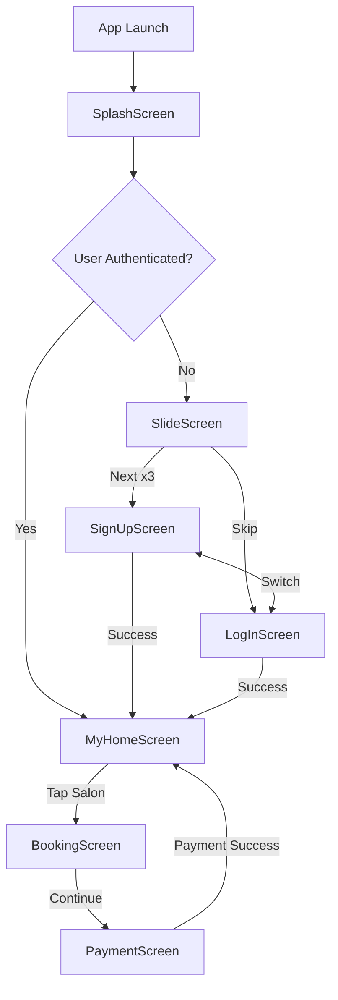
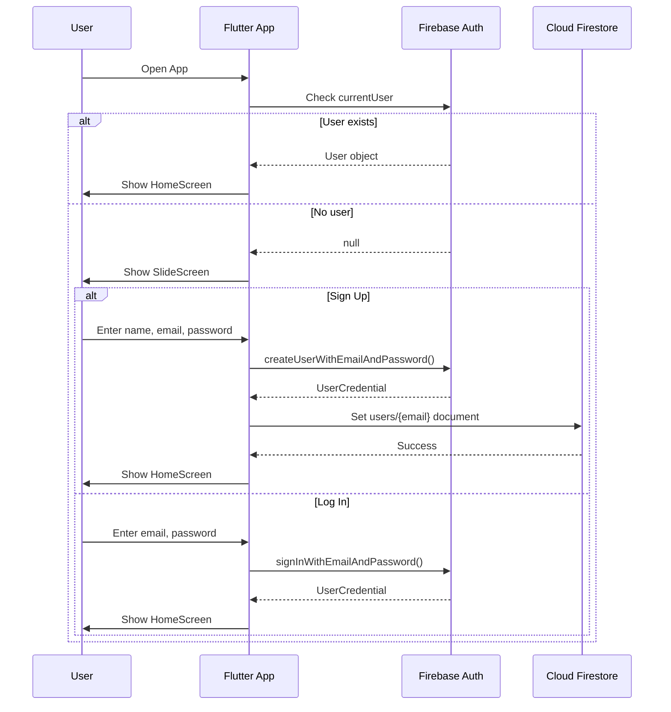
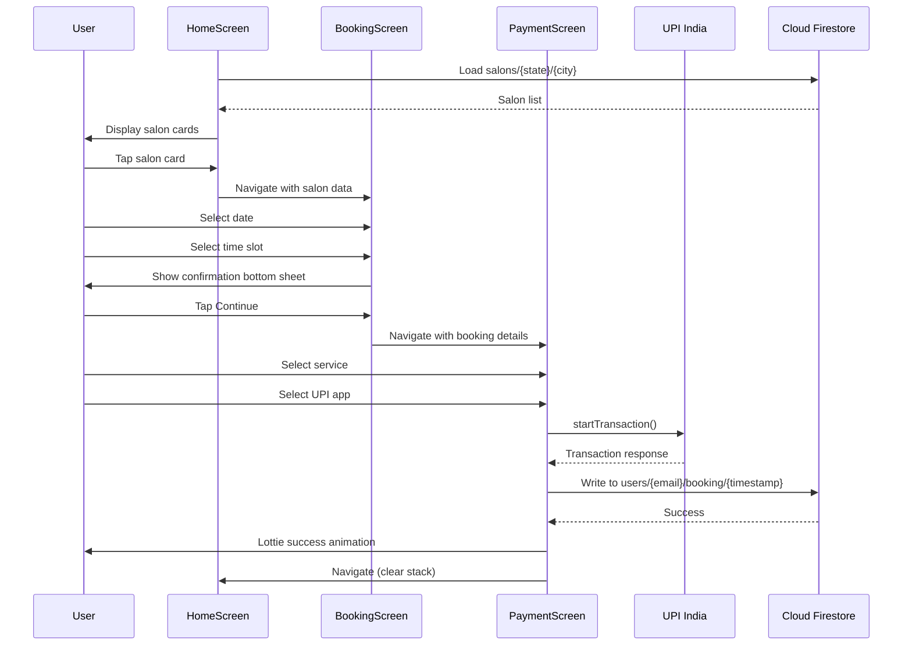
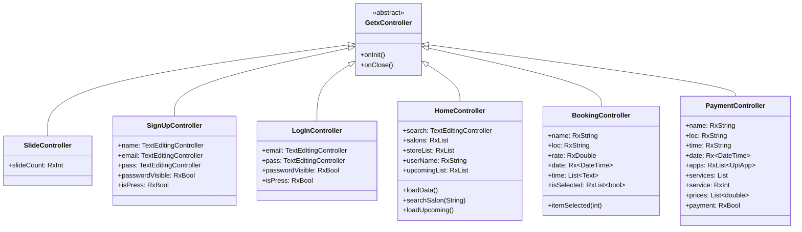
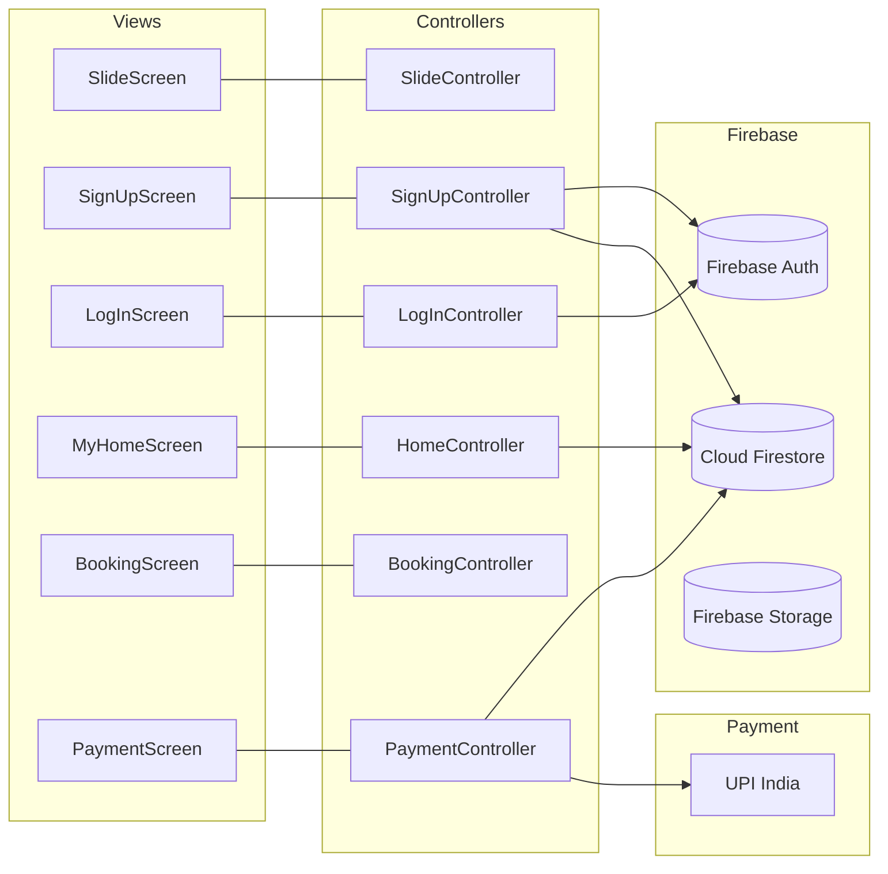
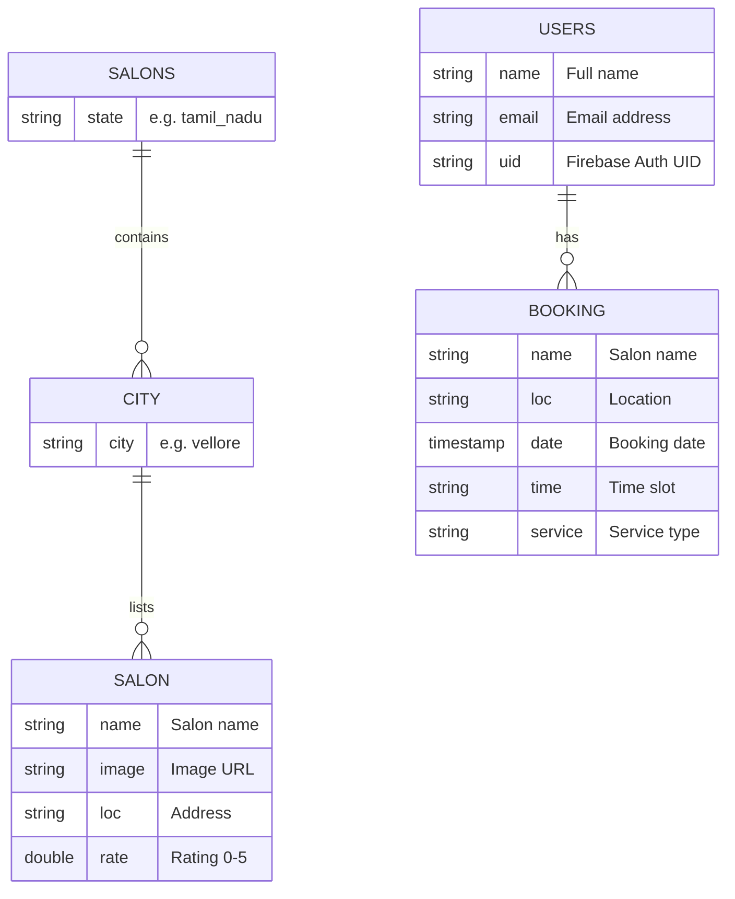
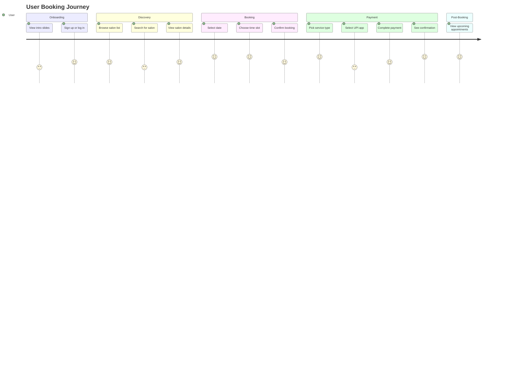
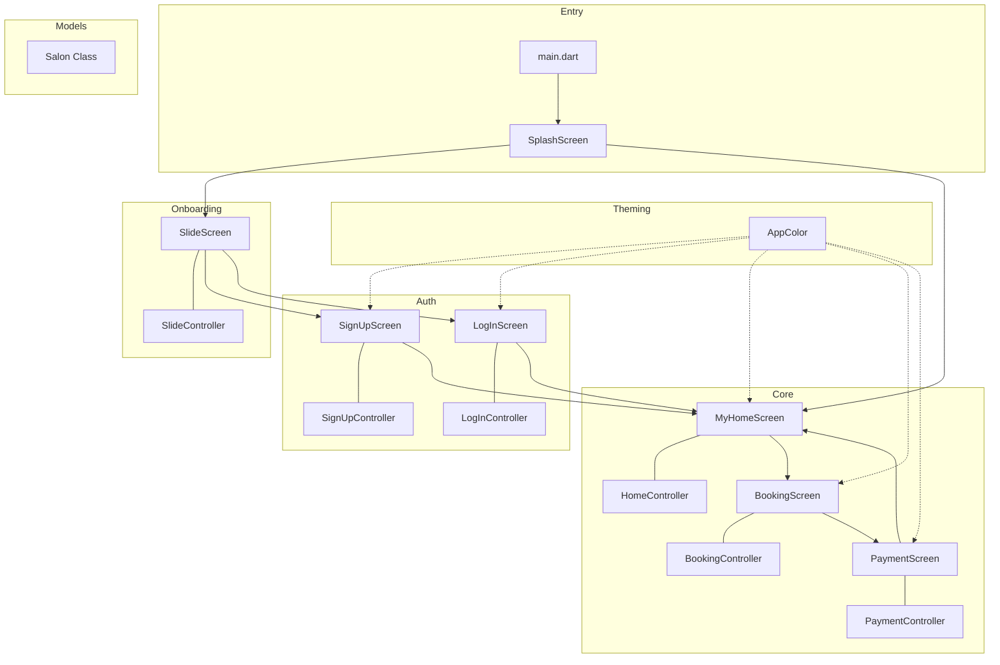
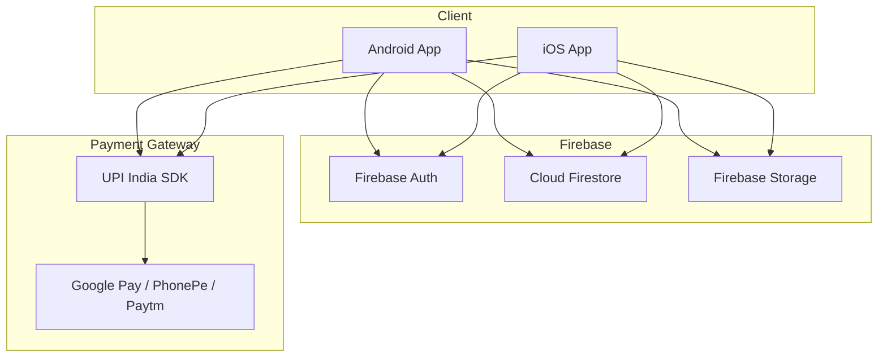

# Harber - Mermaid Diagrams

Visual diagrams of the Harber salon booking app architecture and flows.

---

## App Navigation Flow

---

## Authentication Flow

---

## Booking Flow

---

## State Management Architecture

---

## Screen-Controller Relationships

---

## Firestore Data Model

---

## User Journey

---

## Component Architecture

---

## Deployment Architecture

---

> **Note:** To render these diagrams, use any Mermaid-compatible viewer such as GitHub's built-in Markdown renderer, [mermaid.live](https://mermaid.live), or VS Code with the Mermaid extension.
